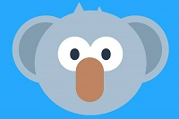
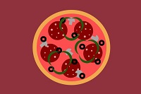
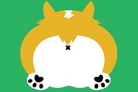
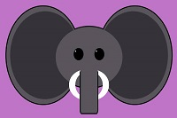
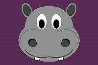
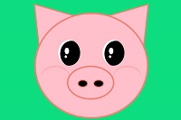
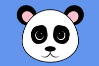
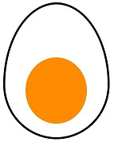

# Pure CSS images

This repository is a set of images created by using HTML and CSS only. They are sequenced according to the creation date. The coala image comes from [this tutorial](https://medium.com/coding-artist/a-beginners-guide-to-pure-css-images-ef9a5d069dd2) by Michael Mangialardi.

||||||
|---------------|---------------|---------------|---------------|---------------|
||||||

---

## How are the images created

Each image consists of at least two files: HTML file and CSS file.

The HTML file will hold the image defined as a tree of `<div/>` elements. Each `div` will define a part of the image (like head, eye, pupil, etc.). Each div will have some `class` attribute assigned. The CSS file will hold the styles that will be applied on the `<div/>` objects, with the class attribute value of those styles.

## Example



Let's create a pure CSS image of an egg. A boiled egg cut in a half, to be precise :egg:.

### HTML file

The definition of the egg image tree will be placed inside the `<body/>` tag. The egg will consist of three `<div/>` objects, each placed as the child of the previous one. As the styles will be defined in the `styles.css` file, we need to attach it to the HTML file. This will be done using the `<link/>` node inside the `<head/>` node of the HTML file.

The first `<div/` will define the egg area. It will have its `class` attribute set to `egg`. With this object we will define the dimensions and the position of the image that we will draw.

The second `div` will be the egg white. It will have its `class` attribute set to `egg-white`. We will place this object inside the `div` with the `egg` class. This way the drawing will be visible within the previously defined area.

The third `div` will be the egg yolk. It will have its `class` attribute set to `egg-yolk`. Just like in the real life, the yolk will be visible inside the egg white, so this object must be defined as the child of the previous `div`.

The complete HTML file will look like this:

``` HTML
<html>
<head>
    <link rel="stylesheet" type="text/css" href="styles.css">
</head>

<body>
    <div class="egg">
        <div class="egg-white">
            <div class="egg-yolk"/>
        </div>
    </div>
</body>
</html>
```

### CSS file

We'll start from defining the area that the image will be visible in. This will be defined by the `egg` class.

``` CSS
.egg{
}
```

 First, we define the width and height of the drawing area. To keep the dimensions fixed, we'll provide the width and height in pixels, as well define the display type as `block` and the position as `relative`.

 If you try to display the image now, you won't see anything. You can set the border of the egg class, or its background, to help you visualize where the egg will be drawn.

 ``` CSS
 .egg{
    position: relative;
    display: block;
    width: 270px;
    height: 350px;
    background: pink; /* this will help you visualize the image area */
 }
 ```

 Now let's draw the egg white. We'll start from defining the size of the egg. The `position` property needs to be set to `absolute` and the `display` property to `block`. Unlike for the previous class, we will define the `width` and `height` values in percent. This way if you decide to change the size of the egg, the proportions of the image will stay fixed. We will also add a small `black` `border` of the size of `5px` drawn with a `solid` pen. The `background` of course will be `white`.

 ``` CSS
 .egg-white {
    position: absolute;
    width: 95%;
    height: 95%;
    background: white;
    border: black 5px solid;
}
 ```

 Now we have a rectangle of the dimensions similar to the drawing area, but the egg is not a rectangle. In order to achieve the egg shape, we will take advantage of the `border-radius` property.

 ``` CSS
 .egg-white {
    position: absolute;
    width: 95%;
    height: 95%;
    border-radius: 50% 50% 50% 50% / 60% 60% 40% 40%;
    background: white;
    border: black 5px solid;
}
 ```

As we have an egg-shaped white object, we now can continue with drawing the egg yolk. This will be far more simple than the egg white, as the yolk will be a  circle. Therefore the `border-radius` value will be as simple as `50%`.

``` CSS
.egg-yolk {
    position: absolute;
    top: 40%;
    left: 20%;
    width: 60%;
    height: 50%;
    border-radius: 50%;
    background: darkorange;
    border: none;
}
```

The complete CSS file will look like this:

``` CSS
.egg {
    position: relative;
    display: block;
    width: 270px;
    height: 350px;
}

.egg-white {
    position: absolute;
    width: 95%;
    height: 95%;
    border-radius: 50% 50% 50% 50% / 60% 60% 40% 40%;
    background: white;
    border: black 5px solid;
}

.egg-yolk {
    position: absolute;
    top: 40%;
    left: 20%;
    width: 60%;
    height: 50%;
    border-radius: 50%;
    background: darkorange;
    border: none;
}
```

[Go to top](#pure-css-images)
