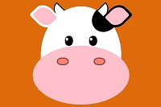

# Pure CSS images

This repository is a set of images created by using HTML and CSS only. They are sequenced according to the creation date. The coala image comes from [this tutorial](https://medium.com/coding-artist/a-beginners-guide-to-pure-css-images-ef9a5d069dd2) by Michael Mangialardi.

||||||
|---------------|---------------|---------------|---------------|---------------|
||||||

[Go to top](#pure-css-images)
